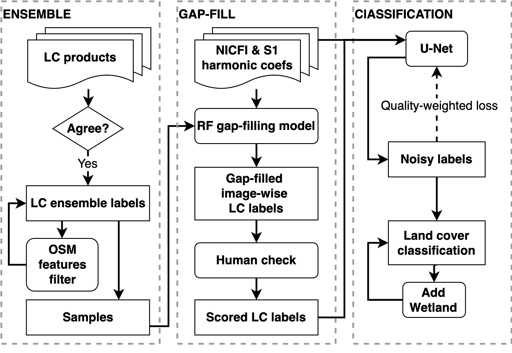

```{r setup, include=FALSE}
knitr::opts_chunk$set(echo = F)
library(here)
```

```{r, eval = FALSE, include=FALSE}
library(here)
library(terra)
library(stars)
library(tmap)
library(ggpubr)
library(gridExtra)

pred_path <- here(file.path('results/dl/prediction',
                           'unet_k15_only_clr_200epc',
                           'landcover_north_withwl.tif'))
color_tb <- data.frame(
    id = 1:8,
    type = c("Cropland", "Forest", 
             "Grassland", "Shrubland", 
             "Water", 'Built-up', "Bareland", 
             'Wetland'),
    color = c('#ff7f00', '#074702', '#b2df8a',
              '#33a02c', '#3347f9', '#5a6057',
              '#fdbf6f', '#0ea591'))
# pred <- read_stars(pred_path)
pred <- rast(pred_path)
setCats(pred, value = color_tb$type, index = color_tb$id)
pred <- st_as_stars(pred)

# plot
tmap_mode("plot")
pred_final <- tm_shape(pred) +
    tm_raster("landcover_north", 
              title = "Land cover types",
              n = 8, style = 'cat',
              labels = color_tb$type,
              palette = color_tb$color) +
    tm_layout(frame = F,
              legend.show = F,
              outer.margins = c(0.02, 0.01, 0, 0.01),
              inner.margins = 0,
              bg.color = 'black')
pred_final <- tmap_grob(pred_final)

# Get legend
r_df <- data.frame(x = 1:8, 
                   y = 1:8,
                   rst = as.factor(1:8))
legend_lc <- ggplot() + 
    geom_raster(
        data = r_df, 
        aes(x = x, y = y, 
            fill = rst)) +
    scale_fill_manual('Land cover',
                      values = color_tb$color, 
                      breaks = 1:8,
                      labels = color_tb$type) +
    theme_minimal() +
    theme(legend.position = 'right',
          legend.text = element_text(color = 'white'),
          axis.title.x = element_blank(),
          axis.text.x = element_blank(),
          axis.ticks.x = element_blank(),
          axis.title.y = element_blank(),
          axis.text.y = element_blank(),
          axis.ticks.y = element_blank(),
          panel.grid.major = element_blank(), 
          panel.grid.minor = element_blank(),
          plot.margin = unit(rep(0, 4),"cm"),
          plot.background = element_rect(fill = "black"))+
    guides(fill = guide_legend(ncol = 4))
legend_lc <- get_legend(legend_lc)
pred_final_plt <- ggarrange(pred_final, legend_lc, NA,
                        nrow = 3, heights = c(5, 1, 0.6))
ggsave(here('docs/figures/nasa_poster_result_img.png'),
       pred_final_plt, bg = 'black',
       width = 6, height = 6, dpi = 300)
ggsave(here('docs/figures/nasa_poster_title_img.png'),
       ggarrange(pred_final, bg = 'black',
       width = 6, height = 6, dpi = 300)
```

## Introductions 

We proposed a method to make timely and accurate land cover maps in data-sparse regions, such as Tanzania. The main motivation of this project is that land cover products over Sub-Saharan Africa, including Tanzania, have poor quality.

For instance, the following is the evaluation of some LC products in Northern Tanzania based on our test dataset.

```{r}
library(tibble)
library(kableExtra)
lc_products <- tibble(
  `Product name` = c('CGLS_LC100m', 'FROM-GLC 2017v1', 'GFSAD30', 'TanSIS'),
  `Product type` = c('Land cover', 'Land cover', 'Crop mask', 'Crop mask'),
  Year = c(2018, 2017, 2015, 2018),
  Resolution = c('100 m', '30 m', '30 m', '250 m'),
  `Overall accuracy` = c('67.70%', '60.13%', '82.93%', '82.39%'))
lc_products %>%
  kbl() %>%
  kable_paper("striped", full_width = F) %>%
  row_spec(0, bold = T) %>% 
  row_spec(0:4, color = "white", background = 'black')
```

---

## Methodology

Stage 1: We extracted the consensus of multiple existing land cover products to generate fragmented pixel-wise training labels. 

Stage 2: We translated pixel-wise training labels to image-wise labels using the random forest as a guessing model and satellite images. 

Stage 3: We fine-tuned a U-Net network based upon these image-wise labels using Sentinel-1 time series and raw bands of NICFI basemaps as image features. 

```{r, fig.align='center', out.width = "60%"}

```

---

## Sub-tiling system and different types of label

```{r, eval=F}
library(raster)
library(glue)
library(here)
library(sf)
library(nngeo)
library(ggplot2)
library(RColorBrewer)
library(dplyr)
library(sf)
library(rasterVis)
library(ggnewscale)
library(cowplot)
library(ggpubr)

# Read boundaries
study_area <- read_sf(here('data/geoms/study_area.geojson')) %>% 
    st_remove_holes()
nicfi_tiles <- read_sf(here('data/geoms/tiles_nicfi_north.geojson')) %>% 
    mutate(`NICFI tile` = 1)

# Make the main figure
main_fg <- ggplot(nicfi_tiles) +
    geom_sf(fill = NA, 
            aes(color = "black", lty = "dotted"), 
            lwd = 0.4) +
    geom_sf(data = study_area, fill = NA, 
            aes(color = 'red', lty = 'solid')) +
  scale_color_identity(name = '',
                         breaks = c('black', 'red'),
                         labels = c('NICFI tiles', 'Study area'),
                         guide = 'legend') +
    scale_linetype_identity(name = '',
                            breaks = c('dotted', 'solid'),
                            labels = c('NICFI tiles', 'Study area'),
                            guide = 'legend') +
    theme_minimal() + 
    theme(legend.position = 'none',
          axis.title.x = element_blank(),
          axis.text.x = element_blank(),
          axis.ticks.x = element_blank(),
          axis.title.y = element_blank(),
          axis.text.y = element_blank(),
          axis.ticks.y = element_blank(),
          plot.margin = unit(rep(0, 4),"cm"))
save(main_fg, file = 'figures/nasa_tiling.rda')

id_selected <- '1240-995'
# Read tiles
nicfi_tiles <- read_sf(
    here('data/geoms/tiles_nicfi_north.geojson'))

# Sub-tiling
indices <- matrix(1:64, 8, 8)
indices <- indices[, ncol(indices):1]
sub_tiling <- nicfi_tiles %>% 
    filter(tile == id_selected) %>% 
    st_make_grid(n = c(8, 8)) %>% 
    st_sf() %>% 
    mutate(index = as.vector(indices))
trains_inside <- sub_tiling %>% 
    filter(index %in% (read.csv(
    here('results/north/dl_catalog_train.csv'),
    stringsAsFactors = F) %>% 
    filter(tile == id_selected) %>% 
    pull(index))) %>% 
    mutate(Usage = 'Train')
valids_inside <- sub_tiling %>% 
    filter(index %in% (read.csv(
    here('results/north/dl_catalog_valid.csv'),
    stringsAsFactors = F) %>% 
    filter(tile == id_selected) %>% 
    pull(index))) %>% 
    mutate(Usage = 'Validate')
# Labels of each sub-tile
sub_tiles <- rbind(trains_inside, valids_inside) %>% 
    arrange(index); rm(trains_inside, valids_inside)

# Sub-tiling figure
sub_tiling_fg <- ggplot(sub_tiling) + 
    geom_sf(data = sub_tiles, aes(fill = Usage),
            color = 'blue', lwd = 0.3) +
    scale_fill_manual(values = c('forestgreen', 'orangered')) +
    geom_sf(color = 'blue', fill = NA, lwd = 0.3) + 
    geom_sf_text(aes(label = index), size = 2.5) +
    theme_minimal() +
    theme(legend.position = 'bottom',
          axis.title.x = element_blank(),
          axis.text.x = element_blank(),
          axis.ticks.x = element_blank(),
          axis.title.y = element_blank(),
          axis.text.y = element_blank(),
          axis.ticks.y = element_blank(),
          panel.grid.major = element_blank(), 
          panel.grid.minor = element_blank(),
          plot.title = element_text(hjust = -0.15, vjust = -6),
          plot.margin = unit(rep(0, 4),"cm"))

# Weak labels
labels_esb <- lapply(1:nrow(sub_tiles), function(n){
    raster(here('data/north/lc_labels_north_mask.tif')) %>% 
        crop(sub_tiles %>% slice(n))
}); names(labels_esb) <- sub_tiles$index

labels_guess <- lapply(sub_tiles$index, function(id){
    prefix <- glue('results/north/guess_labels/guess_{id_selected}')
    raster(here(glue('{prefix}_{id}.tif')))
}); names(labels_guess) <- sub_tiles$index

labels_refine <- lapply(sub_tiles$index, function(id){
    prefix <- glue('results/north/refine_labels/{id_selected}')
    raster(here(glue('{prefix}_{id}_label.tif')))
}); names(labels_refine) <- sub_tiles$index

# Plot
color_tb <- data.frame(
    id = 1:7,
    type = c("Cropland", "Forest", 
             "Grassland", "Shrubland", 
             "Water", 'Built-up', "Bareland"),
    color = c('#ff7f00', '#074702', '#b2df8a',
              '#33a02c', '#3347f9', '#5a6057',
              '#fdbf6f'))
plot_rst <- function(rst, bry){
    r_df <- as.data.frame(rst, xy = TRUE) %>%
        `colnames<-`(c('x', 'y', 'rst')) %>%
        mutate(rst = as.factor(rst)) %>% 
        na.omit()
    colors <- color_tb %>% filter(id %in% unique(r_df$rst))
    
    # plot
    ggplot() + 
        geom_raster(
            data = r_df, 
            aes(x = x, y = y, 
                fill = rst)) +
        scale_fill_manual(
            values = colors %>% pull(color), 
            breaks = colors %>% pull(id),
            labels = colors %>% pull(type)) +
        geom_sf(data = bry, 
                color = 'blue', fill = NA,
                lty = 'dotted', lwd = 0.4) +
        theme_minimal() +
        theme(legend.position = 'none',
              axis.title.x = element_blank(),
              axis.text.x = element_blank(),
              axis.ticks.x = element_blank(),
              axis.title.y = element_blank(),
              axis.text.y = element_blank(),
              axis.ticks.y = element_blank(),
              panel.grid.major = element_blank(), 
              panel.grid.minor = element_blank(),
              plot.margin = unit(rep(0, 4),"cm"))
}

plots_esb <- lapply(1:length(labels_esb), function(n) {
    nm <- names(labels_guess)[n]
    bry <- sub_tiles %>% filter(index == nm)
    plot_rst(labels_esb[[n]], bry)
})

plots_guess <- lapply(1:length(labels_guess), function(n) {
    nm <- names(labels_guess)[n]
    bry <- sub_tiles %>% filter(index == nm) %>% 
        st_transform(crs = crs(labels_guess[[n]]))
    plot_rst(labels_guess[[n]], bry)
})

plots_refine <- lapply(1:length(labels_refine), function(n) {
    nm <- names(labels_refine)[n]
    bry <- sub_tiles %>% filter(index == nm) %>% 
        st_transform(crs = crs(labels_refine[[n]]))
    plot_rst(labels_refine[[n]], bry)
})

# Ensemble plots
## Legend
r_df <- data.frame(x = 1:7, 
                   y = 1:7,
                   rst = as.factor(1:7))
legend_lc <- ggplot() + 
    geom_raster(
        data = r_df, 
        aes(x = x, y = y, 
            fill = rst)) +
    scale_fill_manual('Land cover',
                      values = c('#ff7f00', '#074702', '#b2df8a',
                                 '#33a02c', '#3347f9', '#5a6057',
                                 '#fdbf6f'), 
                      breaks = 1:7,
                      labels = c("Cropland", 'Forest', "Grassland", 
                                 'Shrubland',  "Water", "Built-up",
                                 'Bareland')) +
    theme_minimal() +
    theme(legend.position = 'right',
          axis.title.x = element_blank(),
          axis.text.x = element_blank(),
          axis.ticks.x = element_blank(),
          axis.title.y = element_blank(),
          axis.text.y = element_blank(),
          axis.ticks.y = element_blank(),
          panel.grid.major = element_blank(), 
          panel.grid.minor = element_blank(),
          plot.margin = unit(rep(0, 4),"cm"))+
    guides(fill = guide_legend(ncol = 2))

legend_lc <- get_legend(legend_lc)
sub_tiling_fg <- ggarrange(NULL, sub_tiling_fg, legend_lc, NULL,
                           nrow = 4, heights = c(0.3, 2, 1, 0.3))

esb_fg <- ggarrange(plotlist = plots_esb, ncol = 4,
                    labels = sub_tiles$index, 
                    hjust = -2.5)
guess_fg <- ggarrange(plotlist = plots_guess, ncol = 4)
refine_fg <- ggarrange(plotlist = plots_refine, ncol = 4)
fgs <- ggarrange(esb_fg, guess_fg, refine_fg, nrow = 3,
                 labels = c('A', 'B', 'C'),
                 hjust = 0.4, vjust = 6,
                 font.label = list(face = "plain"))
labels_fg <- ggarrange(NULL, fgs, sub_tiling_fg, 
                       ncol = 3, widths = c(0.1, 2, 1))
fg <- ggarrange(main_fg, labels_fg, ncol = 2, widths = c(1, 1.8))
ggsave(here('docs/figures/nasa_poster_exp_img.png'),
       fg, bg = 'white', width = 10, height = 4, dpi = 300)
```

- We used NICFI basemap tiling system to manage the whole study area. 
- We split each tile into 8 * 8 sub-tiles. Within each tile, we randomly selected 4 sub-tiles (3 for training and 1 for validation) to make image-wise training labels with quality information. 


```{r, fig.align='center', warning=F, message=F, fig.width=10, fig.height=4, fig.cap = "A: fragmented consensus labels, B: Image-wise RF guessed label, C: Human refined label"}

```

---

## U-Net training

```{r, fig.align='center', out.width = "90%"}

```
---

## Results

```{r, fig.align='center', out.width = "80%"}

```

---

## Results

```{r, fig.align='center', out.width = "90%", warning=F, message=F}

load(here('docs/figures/conf_mean_std.rda'))
mean_std %>% 
  dplyr::filter(Landcover != 'Wetland') %>% 
  t() %>% 
  kbl() %>%
  kable_paper("striped", full_width = F, font_size = 16) %>%
  column_spec(1, bold = T) %>% 
  row_spec(1:2, color = "white", background = 'black')
```


